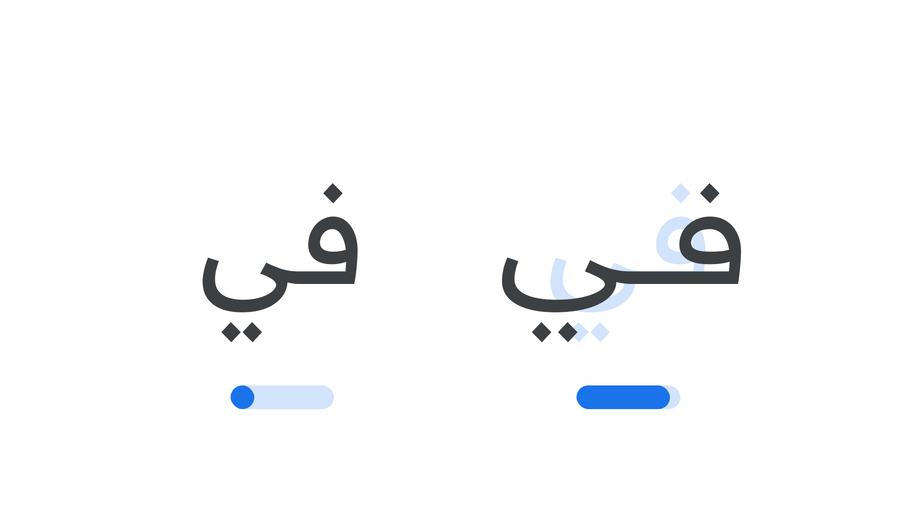

“Hyper Expansion” (HEXP in CSS) is an axis found in some [variable fonts](/glossary/variable_fonts) that can be used to stretch the distance among glyphs by increasing the width of the glyphs themselves and also their connections (in joined writing models) or the spacing (in disconnected writing models).

The [Google Fonts CSS v2 API ](https://developers.google.com/fonts/docs/css2) defines the axis as:

| Default: | Min: | Max: | Step: |
| --- | --- | --- | --- |
| 0 | 0 | 100 | 0.1 |

<figure>

</figure>

<figcaption>Typeface: [Readex Pro](https://fonts.google.com/specimen/Readex+Pro)</figcaption>

Although at first glance Hyper Expansion may appear similar to the Width axis (wdth in CSS), its chief concern is legibility, and specifically with the Arabic script. For detailed information, please read [“The Design of Readex Pro” on the Material Design blog](https://material.io/blog/readex-pro-legibility-arabic-type-design).