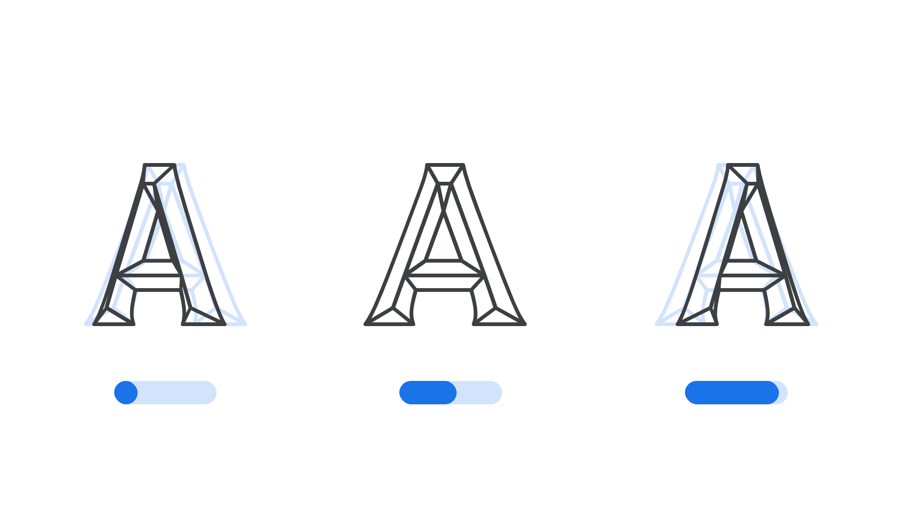

“Rotation in X” (XROT in CSS) is an axis found in some variable fonts that can be used to alter the letterforms so that they appear to rotate in the X dimension, giving the impression that they can interact in a three-dimensional space.

The [Google Fonts CSS v2 API ](https://developers.google.com/fonts/docs/css2) defines the axis as:

| Default: | Min: | Max: | Step: |
| --- | --- | --- | --- |
| 0 | -180 | 180 | 1 |

<figure>

</figure>

Leaving the axis at its default value of 0 results in the character appearing face-on; manipulating it to its minimum value results in it appearing to turn to the left; manipulating it to its maximum value results in it appearing to turn to the right.

It may be used in conjunction with other axes controlling Y-transparencies (vertical alignment zones), especially the Parametric Uppercase Height axis (YTUC) and Parametric Descender Depth axis (YTDE).